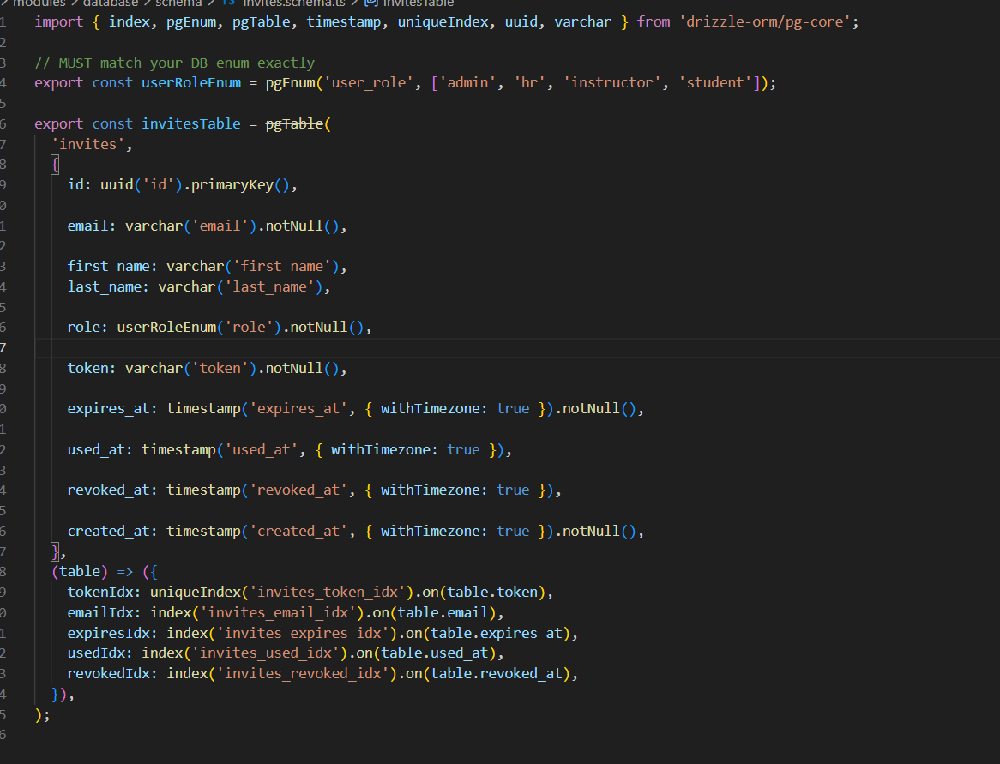
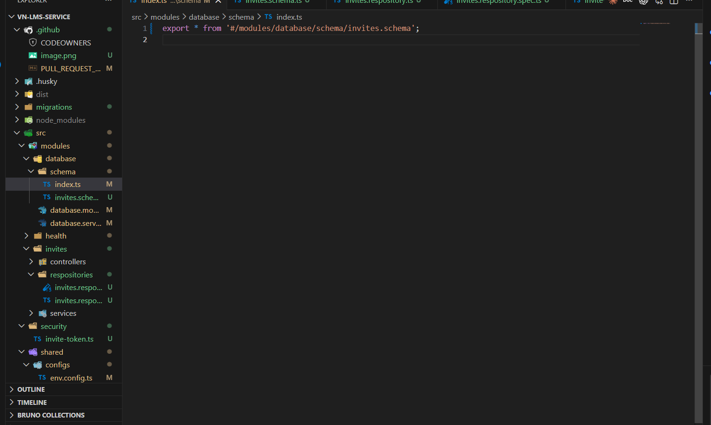
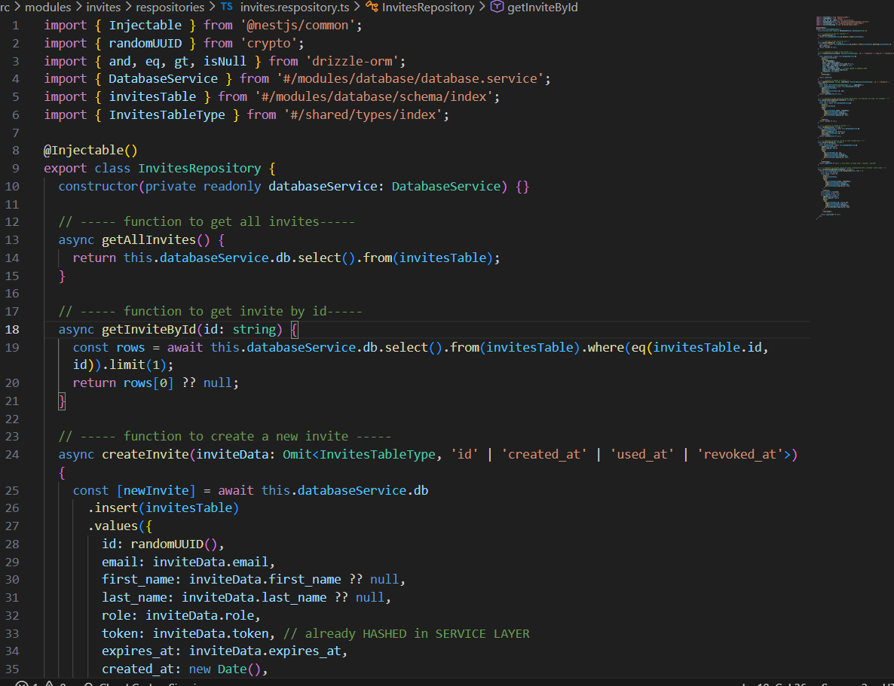
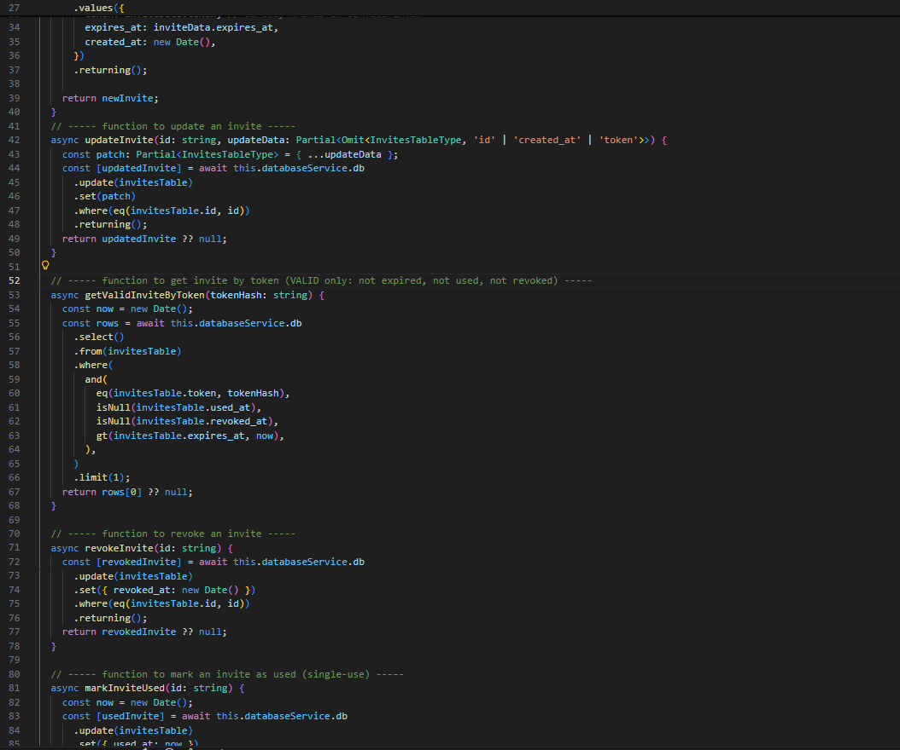
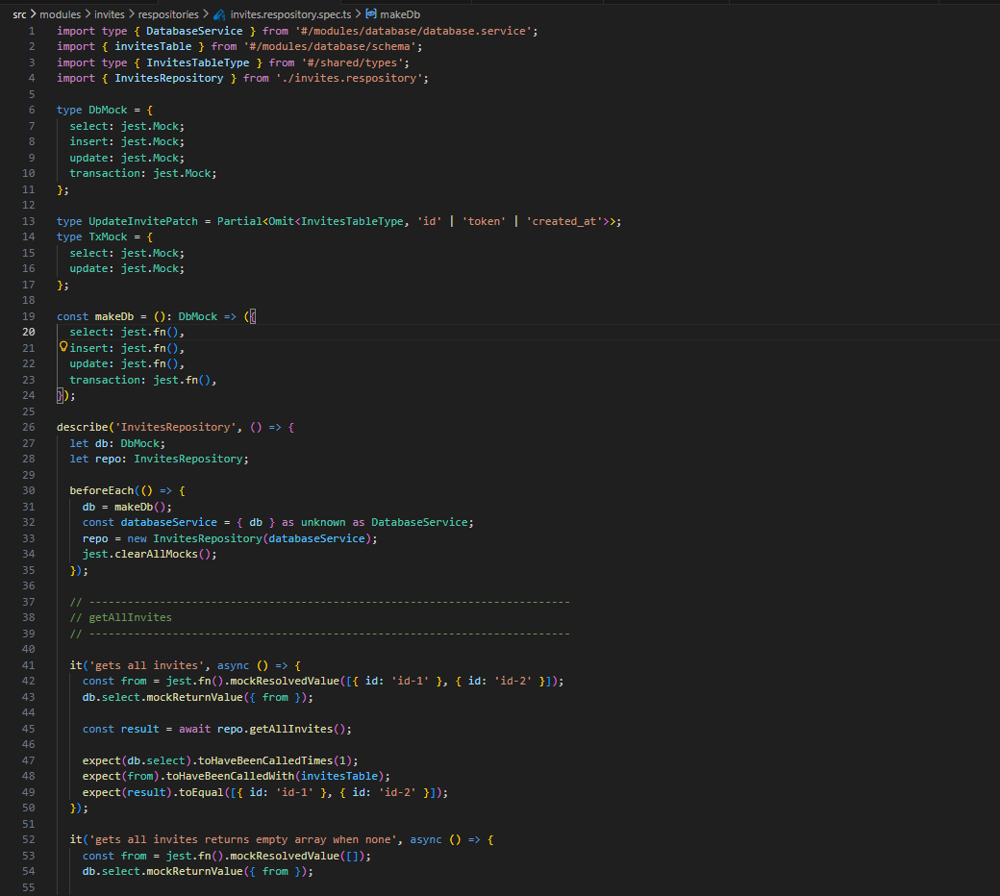
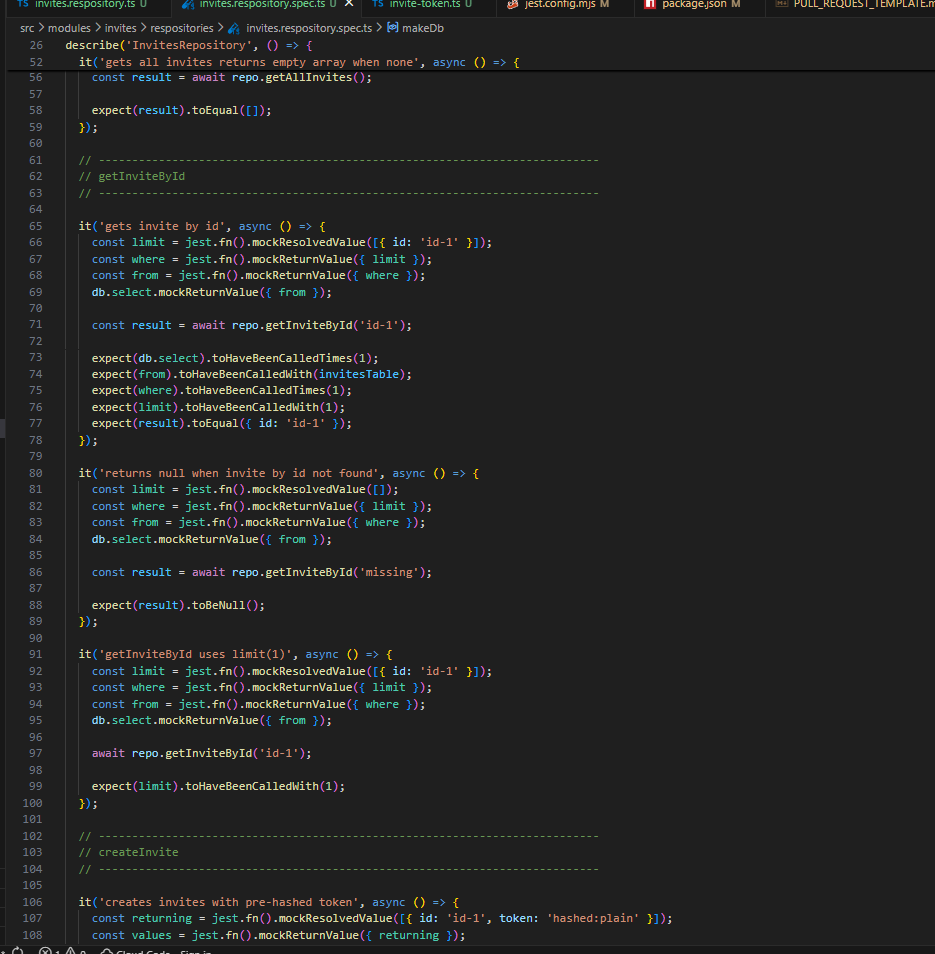
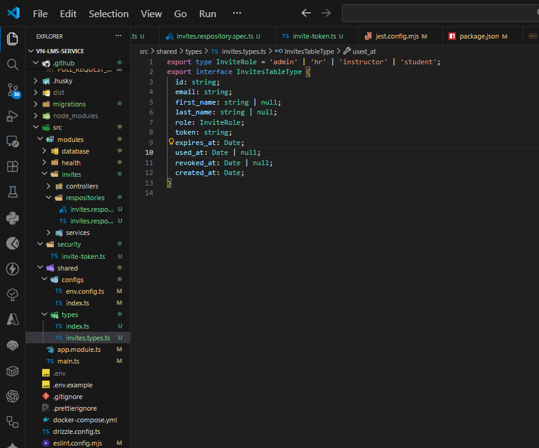
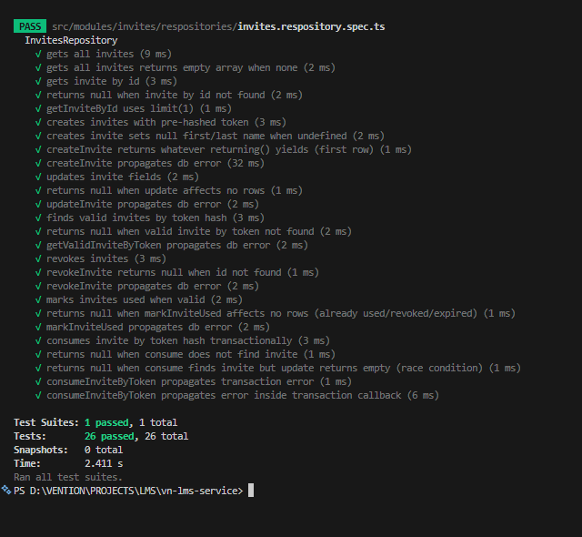

# PR Description

## 📌 Related Task

[PANTHERS-12](https://vn-lms.atlassian.net/jira/software/projects/PANTHERS/boards/1?selectedIssue=PANTHERS-12)

---

## 📋 Summary of Changes

## Summary
1. Created the migration for the `invites` table.
2. Added the invite token hashing utility (`src/security/invite-token.ts`) using `argon2id`.
3. Ensured the invites schema includes indexes for `used_at` and `revoked_at`.
4. Updated the invites repository to align with pre‑hashed tokens.
5. Added/updated unit tests for `InvitesRepository`.
6. Fixed Jest alias resolution (`#/…`) and ESLint config issues.
7. Ran ESLint with `--fix` to resolve formatting/type‑lint errors.

### Screenshots

1. Created the schema object for Drizzle to handle

2. Imported it from the index.ts to follow the conventions

3. Kept the modularity and saved the repository in modules>invites>invites.repository.ts with the following content

4. Implemented Unit tests (26) on the aim of testing the created repository

5. Created shared type for keeping the data in certainty and for data prediction

6. Run the tests and all the 26 tests passed

### Video

(Add video link here if applicable)
